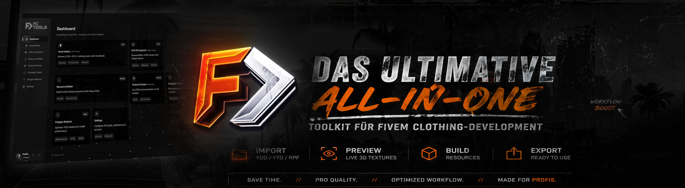
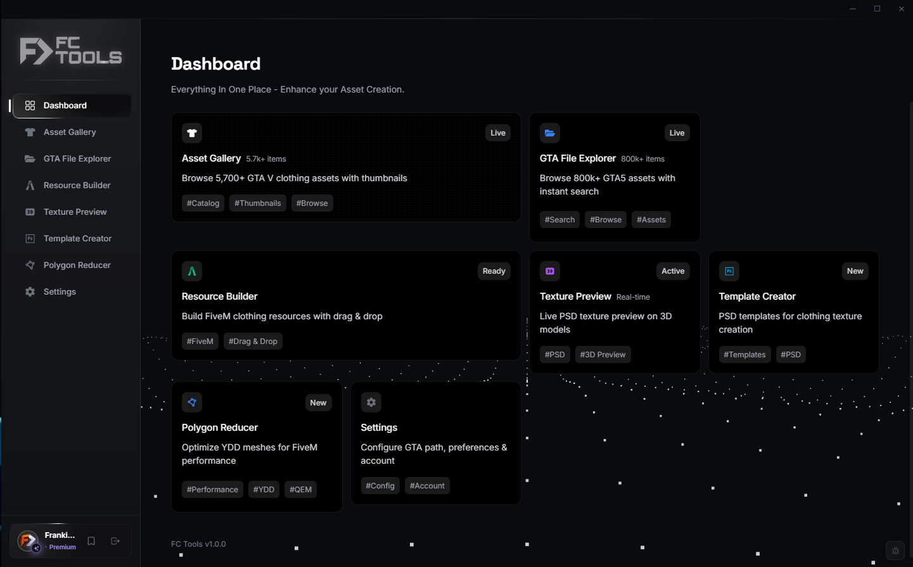
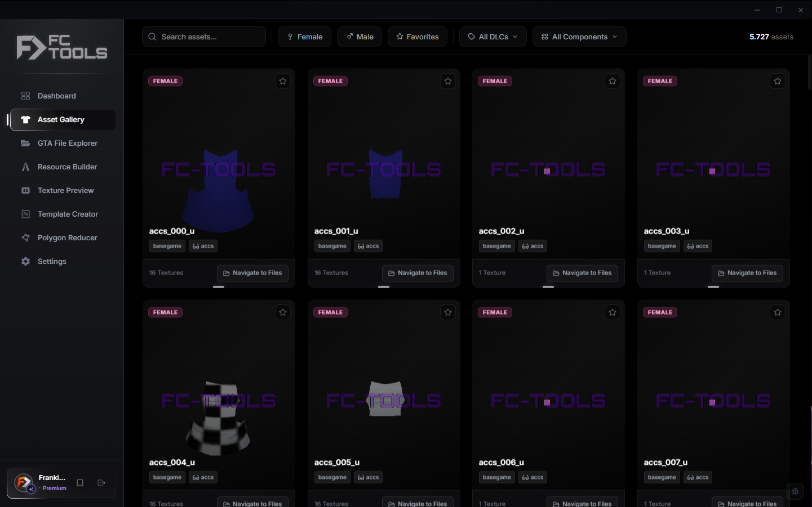
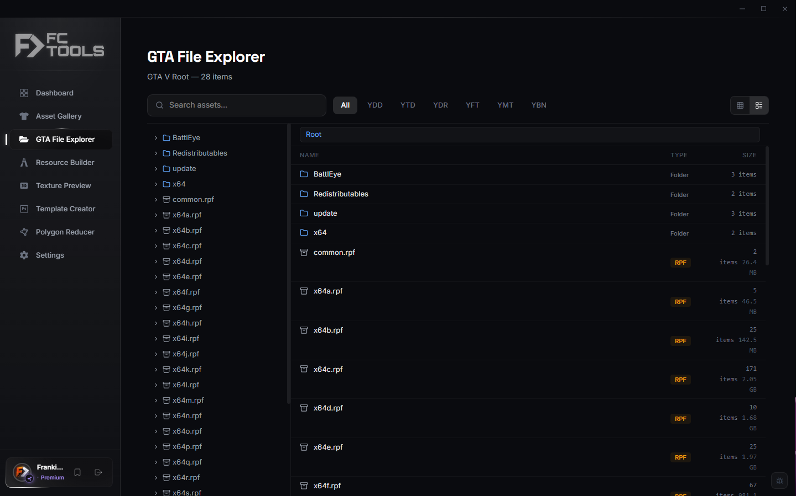
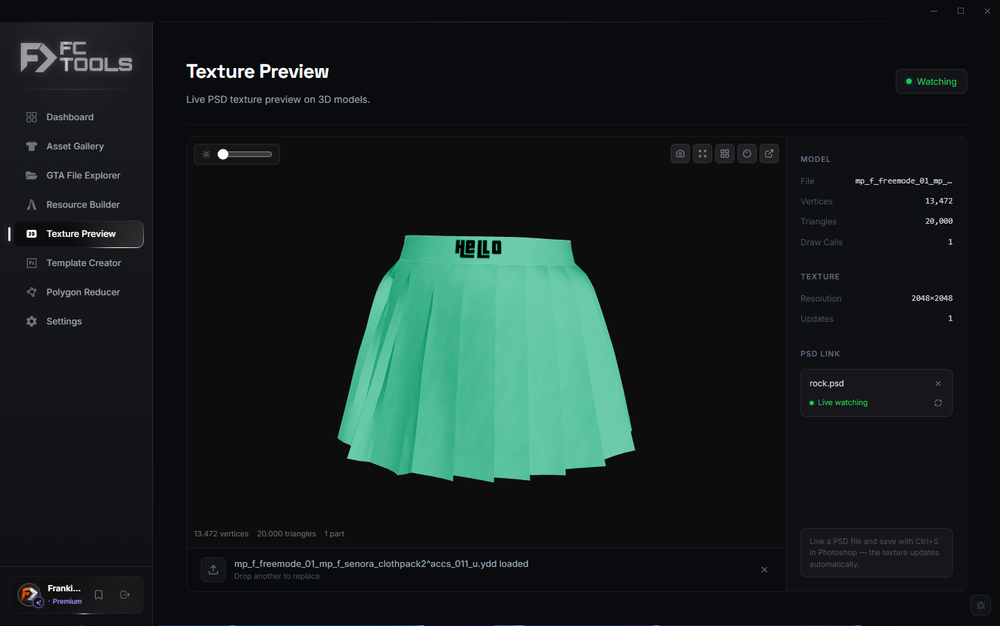
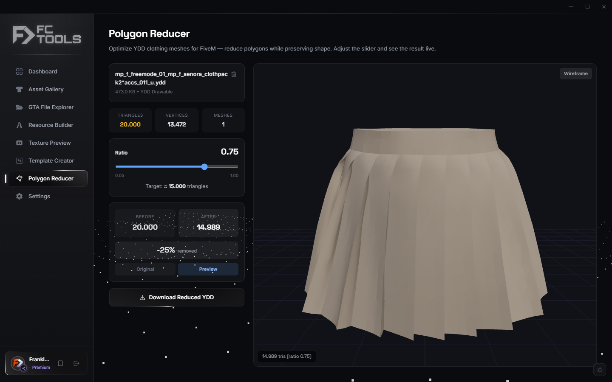
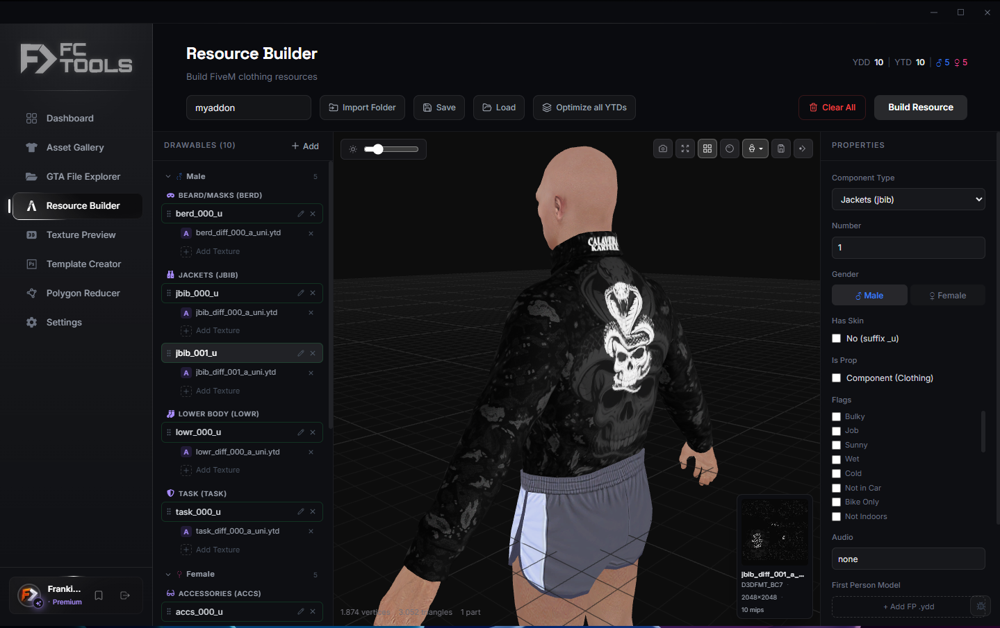
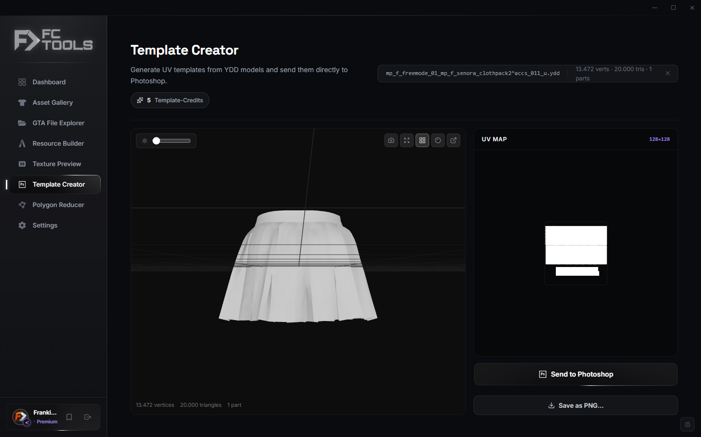

# FC Tools

**The all-in-one app for GTA V / FiveM clothing creators.**

Design, preview and ship MP clothing — from your Photoshop canvas to a ready-to-use FiveM resource — without ever leaving the app.

[**Download**](https://github.com/frankiesclothingdev/FCTools/releases/latest) · [**Report a Bug**](https://github.com/frankiesclothingdev/FCTools/issues) · [**Discord**](https://discord.gg/VCZqDY67xH)

---

## Table of Contents

- [What is FC Tools?](#what-is-fc-tools)
- [Highlights](#highlights)
- [Features](#features)
- [Account & Premium](#account--premium)
- [System Requirements](#system-requirements)
- [Installation](#installation)
- [Updating](#updating)
- [Uninstall](#uninstall)
- [Support](#support)
- [Credits](#credits)
- [License](#license)

---

## What is FC Tools?

**FC Tools** is a Windows desktop application made specifically for GTA V / FiveM clothing creators. It brings everything you need into one polished interface: a 3D preview for your clothes, a live link to Photoshop, a smart polygon optimizer and a one-click resource builder for FiveM.

The goal is simple — replace the patchwork of scattered tools and manual steps with a single, focused app that just works.

---

## Highlights

| | |
|---|---|
|  &nbsp; **Open clothing files directly** | Inspect your work without round-tripping through other tools. |
|  &nbsp; **Live preview** | See exactly how your design will look in the game. |
|  &nbsp; **Polygon Reducer** | Bring high-poly meshes down to game-ready counts in seconds. |
|  &nbsp; **Resource Builder** | Turn your finished clothing into a drop-in FiveM resource with one click. |
|  &nbsp; **Photoshop Live Link** | Save your `.psd` and watch the texture update in the viewer instantly. |
|  &nbsp; **Templates** | Start any new piece from a clean, correctly-prepared template. |
|  &nbsp; **Discord login** | Sign in once with your Discord account — no extra passwords to manage. |

---

## Features

### Asset Library

A clean library of all your project files with thumbnails, search and tagging. Drag clothing or textures straight out into Photoshop or any other tool you use.

### RPF Explorer

Browse `.rpf` archives directly inside FC Tools — no external utility required. Open any contained file in the matching viewer with a single click.

### Texture Preview

Open a texture and see it the same way the game does. Pair it with the **Photoshop Live Link** and every save in Photoshop appears in the preview within milliseconds — no exporting, no manual reloads.

### 3D Viewer

A smooth, fluid 3D preview with intuitive orbit controls and an adjustable brightness slider. Your clothing is shown on the correct character so you can judge fit, drape and proportions immediately.

### Shader Inspector

Tweak the look of your clothing — including emissive ("glowing") effects through the built-in **Glow Pink** preset — and see the result live. When you save, your edits are kept exactly as you set them.

### Polygon Reducer

Aim at a triangle count or a percentage and let FC Tools do the rest. Auto-smoothing keeps silhouettes clean, and a side-by-side comparison shows you the original vs. the optimized result before you commit.

### Resource Builder

One click turns your clothing into a finished FiveM resource — correctly named, correctly structured, ready to drop into your server. The viewer inside the builder lets you walk around the model and double-check everything before exporting.

### Template Creator

Generate a Photoshop template for any clothing slot at the resolution you choose. Each template comes with the right canvas, alpha guides and placeholders, so you can paint right away without manual setup.

### File Associations *(optional)*

Make FC Tools the default for clothing and texture files so you can open them straight from Windows Explorer with a double-click.

---

## Account & Premium

FC Tools uses **Discord** for sign-in. Click the login button, confirm in your browser, and you're back in the app — that's it. No separate account, no extra password.

Premium unlocks the **Polygon Reducer**, **Resource Builder** export, the **Template Creator** and **high-resolution PSD output**.

> **One license = one device.** A premium license stays bound to the computer you first sign in on. If you reinstall Windows or move to a new PC, contact support on Discord and we'll reset your license after verifying ownership.

Your privacy is respected:

- Your project files **never leave your computer**.
- The app does not collect usage statistics or send any kind of analytics.
- The only network calls are Discord login, license check and update check against this repository.

---

## System Requirements

| | |
|---|---|
| **OS** | Windows 10 (1809 or newer) or Windows 11, 64-bit |
| **CPU** | Any modern 64-bit processor |
| **GPU** | A dedicated GPU is recommended for best performance |
| **RAM** | 4 GB minimum, 8 GB recommended |
| **Disk** | About 300 MB |

If anything else is needed for the app to run, FC Tools will guide you through it on first launch. No Photoshop license is required — the Photoshop Live Link works as long as you save your `.psd` files normally.

---

## Installation

1. Open the **[latest release](https://github.com/frankiesclothingdev/FCTools/releases/latest)**.
2. Download `FCTools-<version>.zip`.
3. Right-click the ZIP → **Properties** → tick **Unblock** → **OK**.
4. Extract the contents to a folder you'd like to keep, for example `C:\Tools\FCTools\`.
5. Run **`FCTools.exe`**.

> **Windows SmartScreen:** on first launch Windows may show "Unrecognized app". Click **More info → Run anyway**. This is a normal warning for new applications and goes away as the app builds reputation.

---

## Updating

When a new version is released, just download the new ZIP and replace your existing folder. Your settings and login stay intact.

---

## Uninstall

1. Delete the folder you extracted FC Tools into.
2. *(Optional)* Remove FC Tools as the default app for clothing/texture files via **Windows Settings → Apps → Default apps**.

That's it — FC Tools doesn't run installers, services or background processes.

---

## Support

-  &nbsp; **Questions, feedback, license issues:** join us on **Discord** — that's the fastest way to get help.
-  &nbsp; **Bug reports:** [open an issue](https://github.com/frankiesclothingdev/FCTools/issues/new). Please include your FC Tools version and a short description of what happened.

---

## Credits

FC Tools is built on top of incredible open-source work from the GTA V modding community. Huge shout-out to:

- **[CodeWalker](https://github.com/dexyfex/CodeWalker)** by **dexyfex** — FC Tools uses the `CodeWalker.Core` library for reading and writing GTA V resource files (RPF archives, YDD drawables, YTD textures, YMT meta files and YFT fragments). Without dexy's reverse-engineering and open-source release of CodeWalker, none of the GTA-V-specific tooling in FC Tools — or in most of the modding ecosystem — would exist. Thank you.

CodeWalker is distributed under the MIT License. The full third-party licenses bundled with the release are listed in `wwwroot/legal/third-party-notices.txt` inside the download.
---

## License

FC Tools is proprietary software. The application is licensed to you under the End-User License Agreement included with the download. Source code is **not** distributed — this repository hosts the official downloads only.

**© Frankie's Clothing — All rights reserved.**

